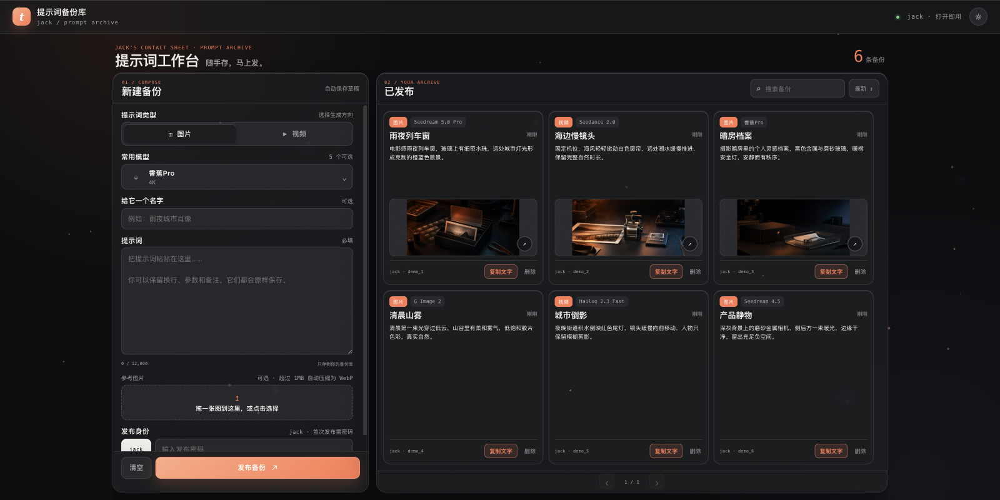
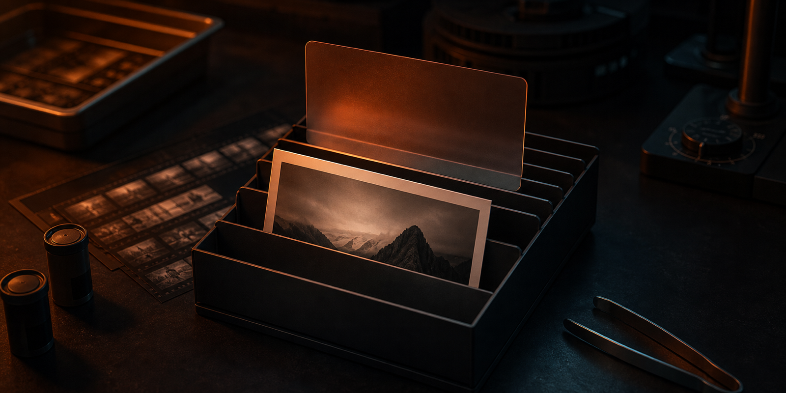
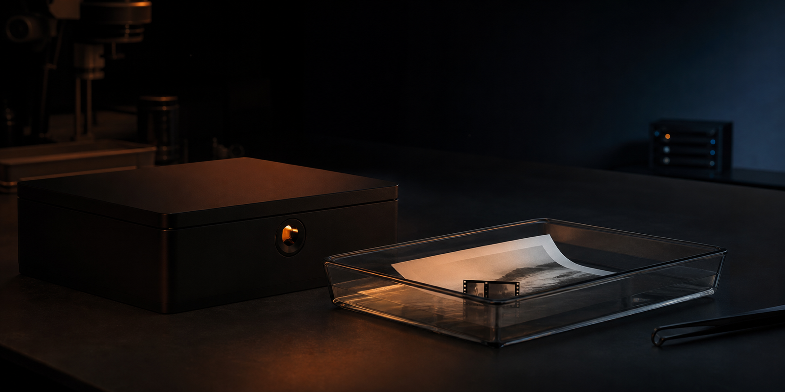

# tishici

ブラウザを開けばすぐ使える個人用プロンプト保管庫です。上にテキスト、下に画像または動画プレビューを置き、作成・公開・閲覧を1ページで完結させます。

[简体中文](../README.md) · [English](README.en.md) · **日本語**

| プロジェクト情報 | 現在の値 |
|---|---|
| 安定版 | `v0.1.0` |
| 実行環境 | PHP 8.1+、最新の Chromium ブラウザ |
| ライセンス | ライセンス未提供 |
| 最終検証日 | 2026-07-27 |

[最新版をダウンロード](https://github.com/sunqinji666-dotcom/tishici/releases/latest) · [クイックスタート](#クイックスタート) · [公開サイト](https://tishici.jack-sun.com/) · [Star / お気に入り](https://github.com/sunqinji666-dotcom/tishici)

## これは何か

tishici は、個人の制作メモを保存する小さなセルフホスト型アーカイブです。生成モデル、タイトル、プロンプト、画像または動画のプレビューを1枚のカードにまとめます。

画面は写真家の暗室を思わせるダークモードで起動します。デスクトップでは1ページに6件を固定表示し、検索、並べ替え、コピー、削除、半透明のメディアビューアを利用できます。

## 役立つ理由

- **すぐに読める**：訪問者はアカウントなしで公開済み項目を閲覧、検索、コピー、拡大表示できます。
- **公開操作を制限**：公開と削除には同じ実行時パスワードが必要で、認証後は現在のセッションに保持されます。
- **下書きはローカル保存**：入力や素材選択を始めると IndexedDB に自動保存し、テキストは localStorage にもフォールバックします。公開成功後は削除されます。
- **ブラウザで圧縮**：1 MiB 以下はそのまま、超過した素材だけをブラウザで変換します。サーバーは種類とサイズを検証するだけです。
- **画像と動画を分離**：種類ごとにモデル選択を用意し、画面全体へのドロップでは素材の種類を自動判定します。
- **素早く見返せる**：プロンプト、モデル、素材を同じカードに集め、目立つコピー操作と6件ページングを備えます。

## クイックスタート

PHP 8.1 以降が必要です。

```bash
git clone https://github.com/sunqinji666-dotcom/tishici.git
cd tishici
cp .env.example .env
```

ローカルの `.env` を編集し、公開と削除だけに使うパスワードを設定します。実際の `.env` はコミットしないでください。

```bash
set -a
. ./.env
set +a
php -S 127.0.0.1:8080 -t site
```

`http://127.0.0.1:8080/` を開きます。

本番環境では `site/` だけをドキュメントルートとして公開し、PHP-FPM の実行環境に `TISHICI_PUBLISH_PASSWORD` を設定してください。PHP には `site/uploads/` と同階層の `tishici-storage/` への書き込み権限も必要です。`ops/tishici-cache-control.conf` には、入口ページ用の任意の nginx キャッシュ無効化設定があります。

## 仕組み

```text
プロンプト入力 / 素材をドロップ
              ↓
ブラウザがローカル下書きを保存
              ↓
ファイル ≤ 1 MiB ───────────────┐
ファイル > 1 MiB → ローカル変換 ├→ パスワード確認 → カード公開
                                  │
サーバーは種類とサイズのみ検証 ──┘
              ↓
公開成功後にローカル下書きを削除
```

画像は WebP に変換されます。動画は 1 MiB 以下の再生可能な WebM プレビューになり、デコード可能で全尺が保持されていることをブラウザが検証します。映像と全尺を優先するため、圧縮後のプレビューには音声を残しません。

## 機能と境界

| 機能 | 動作 |
|---|---|
| 画像入力 | JPG、PNG、WebP |
| 動画入力 | MP4、WebM、MOV |
| 圧縮しきい値 | 1 MiB を厳密に超えた場合だけ開始 |
| サーバー制限 | 結果は 1 MiB 以下。サーバー側の再エンコードなし |
| 下書き | IndexedDB、テキストは localStorage にフォールバック |
| 一覧 | 検索、昇順・降順、1ページ6件 |
| アクセス制御 | 閲覧は公開、公開と削除はパスワード必須 |
| 保存場所 | JSON は `tishici-storage/`、素材は `site/uploads/` |

これは個人サイト向けの軽量な共有パスワード方式であり、複数ユーザーの認証基盤ではありません。権限、パスワード再発行、監査ログ、レート制限はありません。アーカイブを非公開にする必要がある場合は、リバースプロキシ側でより強いアクセス制御を追加してください。

## 実画面とコンセプト画像

このページ先頭の画像は、本ビルドを 1600×800 で撮影した実画面です。カードと素材はすべて合成サンプルで、本番の個人データは含みません。

> **コンセプトイメージ / Concept / 概念示意**：プロンプトと生成結果を写真のネガのように保管する考え方です。追加機能を示す画面ではなく、機能の事実は README と Release ノートを基準とします。



> **コンセプトイメージ / Concept / 概念示意**：大きな素材をブラウザ内で処理してから軽量プレビューを送ります。


> **コンセプトイメージ / Concept / 概念示意**：未公開の下書きはローカルに残し、公開操作だけを軽量パスワードで守ります。



## プライバシーと安全性

- リポジトリに実際の公開パスワードは含めず、アプリは実行時の `TISHICI_PUBLISH_PASSWORD` だけを読み取ります。
- `.env`、実行時 JSON、ユーザー素材、下書き、Release 生成物は Git の対象外です。
- 画像と動画の変換はブラウザ内で行い、サーバーはメディアを変換しません。
- 下書きをサーバーへ自動同期せず、公開成功後はブラウザストレージから削除します。
- 公開済み内容はサイトへアクセスできる全員に見えます。秘密、顧客情報、非公開素材は投稿しないでください。
- エンドツーエンド暗号化や完全な認証システムをうたうものではありません。

## プロジェクト構成

```text
.
├── site/
│   ├── index.html          # 1ページのインターフェース
│   ├── styles.css          # 暗室デザインとレスポンシブレイアウト
│   ├── app.js              # 下書き、圧縮、ドロップ、一覧、ビューア
│   ├── api.php             # 公開、取得、削除、サーバー検証
│   └── uploads/            # 実行時素材。実ファイルはコミットしない
├── ops/
│   └── tishici-cache-control.conf
├── docs/
│   ├── README.en.md
│   ├── README.ja.md
│   └── assets/
├── CHANGELOG.md
└── VERSION
```

## バージョンとダウンロード

現在のバージョンは `v0.1.0` です。[GitHub Releases](https://github.com/sunqinji666-dotcom/tishici/releases/latest) から `tishici-v0.1.0-web-source.zip` をダウンロードし、同名の `.sha256` で検証してください。

```bash
shasum -a 256 -c tishici-v0.1.0-web-source.zip.sha256
```

[CHANGELOG.md](../CHANGELOG.md) と [v0.1.0 Release ノート](RELEASE_NOTES_v0.1.0.md) も参照してください。

## よくある質問

### なぜ完全なアカウント機能がないのですか？

個人用のプロンプト棚として設計しているためです。閲覧を公開し、書き込みだけをパスワードで守る構成は軽量ですが、チーム共同作業や機密情報には向きません。

### なぜ動画は WebM になりますか？

1 MiB を超える動画は、最新の Chromium ブラウザがローカルで軽量な WebM プレビューとして再記録できます。再生可能性と全尺を優先するため、動画が長いほど画質は下がります。

### 「ライセンスなし」とは何ですか？

現時点ではオープンソースライセンスを付与していないため、複製、変更、再配布の追加許可はありません。ライセンスは所有者が今後決定します。
